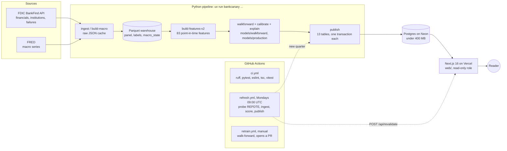

# BankCanary — bank failure early-warning system

> **Status:** Prototype 1 ("Foundation") and Prototype 2 ("Depth") complete; Prototype 3
> ("Product": Postgres publish, weekly refresh and the Next.js dashboard in `web/`) is built and
> awaits the owner's deployment ([`docs/RUNBOOK.md`](docs/RUNBOOK.md) section 7); the live URL
> goes here once it is up. Nothing here is a credit rating, investment advice, or a
> supervisory assessment. See the disclaimer below.

BankCanary is an open, reproducible early-warning system for US bank failures. It ingests
every FDIC-insured bank's quarterly regulatory filings (Call Reports), computes the same
kinds of financial-health ratios bank examiners look at — capital, asset quality, earnings,
liquidity, concentration and interest-rate exposure — and estimates each bank's probability
of failing within the next year.

Unlike most bank-failure projects, BankCanary is built around **strict point-in-time
discipline**: every prediction uses only data that was public on the date the prediction
would have been made, and every model is tested on years it never saw. Its "time machine"
mode lets you pick any quarter since 2006 and see exactly what the model would have flagged
then — and which of those banks actually failed.

The project also asks a harder question: *would a model trained on the 2008 crisis have seen
Silicon Valley Bank coming?* It documents where the classic credit-risk view fails and how
interest-rate and deposit-run indicators close the gap.

## What it does

1. **Ingests** quarterly bank financials and the full failure history from the FDIC BankFind
   API (later: raw FFIEC Call Report schedules and macro data from FRED).
2. **Builds** a clean bank-quarter panel with point-in-time availability dates.
3. **Engineers** interpretable financial-health features grouped by CAMELS.
4. **Labels** each bank-quarter with "fails within H quarters" using a precise, leakage-safe
   definition.
5. **Trains** baseline, statistical and machine-learning models, including a hazard model.
6. **Backtests** walk-forward: train only on the past, predict the next year, repeat.
7. **Explains** every prediction and compares each bank to its peers.
8. **Publishes** every score, driver, ratio and peer percentile to Postgres and serves them
   from a Next.js dashboard (leaderboard, bank profiles, time machine, map, 2023 case
   study, rate-shock what-if, methodology), refreshed weekly when the FDIC posts a quarter.

## Architecture



The weekly refresh probes the FDIC API for the newest report date; when it is newer than
`quarters.max(repdte)` it ingests that quarter, rebuilds the panel, labels and features from
the raw cache, scores it with `models/production/`, explains it with SHAP, upserts the new
rows and asks the web app to drop its query cache. A run with no new quarter takes about a
second and writes one `pipeline_runs` row. Historical walk-forward rows are never rewritten
by the refresh; only `retrain.yml` changes a model, and only through a pull request.

Layers and their homes: ingestion, features and models in `src/bankcanary/`, the publish and
refresh jobs in `src/bankcanary/publish/` and `src/bankcanary/refresh.py`, the schema in
`src/bankcanary/publish/schema.sql` (mirrored by `web/lib/db/schema.ts`, checked by a test),
the dashboard in `web/` (server components, queries in `web/lib/queries/`, one ECharts
wrapper, light and dark themes, an accessibility smoke over every route).

## Getting started

Requires Python 3.12 and [uv](https://docs.astral.sh/uv/).

```bash
uv sync                      # create .venv and install everything
uv run pre-commit install    # lint + format on every commit
uv run pytest                # unit tests (no network access needed)
uv run bankcanary --help     # pipeline commands
```

Copy `.env.example` to `.env` if you need API keys. The FDIC API currently needs none.

If `uv run bankcanary` ever reports `No module named 'bankcanary'`, run
`uv run --no-sync python scripts/fix_venv.py` (or `make fix-venv`). Some macOS tools flag
`.venv` as hidden, and Python 3.12+ then skips the editable-install `.pth` file; the script
adds a `sitecustomize` module that keeps `src/` importable regardless. Tests are unaffected.
The `Makefile` targets are shortcuts for the same `uv run` commands.

### Web app and database (Prototype 3)

```bash
docker compose up -d                 # Postgres 16 on port 5433 (another project holds 5432)
uv run bankcanary publish            # 13 tables from the warehouse + models/production, ~100 s
cd web && npm install                # Node 22, npm 10
npm run build && npm run start       # http://localhost:3100
npm run lint && npm run typecheck && npm test   # what ci.yml runs (no database)
npm run test:e2e                     # Playwright + axe over the built app (needs the database)
```

`DATABASE_URL` lives in the git-ignored `.env`; `web/next.config.ts` copies unset
variables from it, so no `web/.env.local` is needed locally. `bankcanary refresh` is the
weekly job (`bankcanary refresh --dry-run` prints its decision without writing). The
deployment checklist, the secrets each environment needs and the TLS notes are in
[`docs/RUNBOOK.md`](docs/RUNBOOK.md).

## Project layout

See [`PROJECT_SPEC.md`](PROJECT_SPEC.md) for the full specification and
[`docs/CONTRACT.md`](docs/CONTRACT.md) for the build contract (module layout, table
schemas, naming, storage paths) that every component follows.

## Results

Prototype 2 is complete: FDIC data from 2001Q1 to 2026Q2 is ingested and cached, the
bank-quarter panel (710,691 rows, 11,243 banks) carries leakage-safe labels at 1, 4 and 8
quarters, 83 CAMELS, interest-rate, deposit-run, trend and macro features are computed
([`docs/FEATURES.md`](docs/FEATURES.md)), and four models are backtested walk-forward: one
model per test year from 2008 to 2024, trained only on outcomes known before that year's
first prediction date, hyper-parameters re-selected inside each year's training window. Everything a
reader needs is in the model card ([`docs/model_card.md`](docs/model_card.md)) and the
acceptance checklist ([`docs/P2_CHECKLIST.md`](docs/P2_CHECKLIST.md)).

**Walk-forward backtest, 4-quarter horizon** (test years 2008-2024 pooled, 426,019
bank-quarters, 2,103 failures; 95% intervals from 200 cluster-bootstrap draws by bank; from
[`reports/walkforward.md`](reports/walkforward.md)):

| model | PR-AUC | 95% CI | recall @ top 2% | 95% CI | ROC-AUC |
|---|---|---|---|---|---|
| hazard (discrete-time, Shumway 2001) | 0.3268 | [0.294, 0.357] | 0.7038 | [0.679, 0.730] | 0.9575 |
| gbdt_mono (LightGBM, registry monotone signs) | 0.3138 | [0.282, 0.345] | 0.7147 | [0.692, 0.739] | 0.8993 |
| logit (all 83 features, L2, per-year C) | 0.3056 | [0.275, 0.334] | 0.6833 | [0.657, 0.713] | 0.9601 |
| gbdt (LightGBM, unconstrained, per-year tuning) | 0.2647 | [0.236, 0.297] | 0.6367 | [0.603, 0.663] | 0.8204 |
| texas (rank by Texas ratio) | 0.2606 | [0.226, 0.298] | 0.7437 | [0.716, 0.771] | 0.9599 |

**8-quarter horizon** (2008-2023 pooled, 407,621 bank-quarters, 3,768 failures): hazard
PR-AUC 0.4113 [0.382, 0.442], recall@2% 0.6598; logit 0.2566 [0.225, 0.288], 0.5207; gbdt
0.0887 [0.070, 0.108], 0.2200.

The honest reading: the hazard model pools best at both horizons; at 4q its interval
overlaps the logit's, so the backtest does not separate them, while at 8q it is clearly
ahead. Every learner beats the Texas ratio on PR-AUC while the Texas ratio still captures
the most failures in its top 2%. The unconstrained gradient booster is competitive year by
year from 2010 on and weakest pooled, because its early years are starved of failures and
its score scale drifts between years; the same booster under the feature registry's
monotone signs keeps its scale, pools second and is the production model (Decision Point 2,
taken 2026-09-26: the inner validation slice preferred the unconstrained booster, the backtest
prefers the constrained one with disjoint recall intervals, so `settings.models.gbdt.monotone
= true`). `models/production/` holds the promoted 2024 walk-forward `gbdt_mono` and `hazard`
fits with a `model_version.json` each (`scripts/promote_production_models.py`); the SHAP
drivers and the 2023 case study use the monotone booster, which puts Silicon Valley Bank at
the median in 2022Q4 where the unconstrained fit had reached the 95th percentile.
Calibrated probabilities track the observed failure rate for the logit and hazard (pooled
Brier 0.0041 raw, 0.0038 calibrated; top decile 0.042 predicted against 0.045 observed for
the logit). Per-year tables with failure counts, Brier scores and reliability curves are in
the report; years with fewer than ten failures are flagged low confidence. Lead time: of
the 440 banks that
failed in 2009-2012, the logit had put 89.8% in some quarter's top 2% before they failed,
median 5 quarters ahead, 87.7% at least two quarters ahead (hazard 90.5% / 5 / 88.4%).

**The 2023 question.** A credit-only model trained through 2021 put Silicon Valley Bank at
the 65th percentile of all banks on its last report before failure, and adding the
interest-rate and uninsured-deposit features lifts it to the 95th percentile (rank 245 of
4,773) in the gradient booster but not in the logit, which had learned over twenty years
that uninsured deposits marked size rather than risk. None of the four models put SVB in
its top 2%, Signature was flagged only by the credit-only logit on its concentration
profile, and First Republic by nothing.

**Prototype 3** promotes the 2024 walk-forward `gbdt_mono` fit to the production model
(`model_version = <model>-<train end>-<git sha>` on every published row; `hazard` is the
secondary score), scores every label-incomplete quarter with it, ranks banks into risk bands
by percentile (`high` top 2%, `elevated` top 2-10%, `low`, always shown with the calibrated
probability), and publishes 13 tables that stay under Neon's 400 MB free tier
([`docs/CONTRACT.md`](docs/CONTRACT.md) section 16 lists them and the precision trade-offs
that got there). The time machine reproduces the backtest exactly: a quarter's rows come
from the walk-forward model of its test year, and a database test checks that their
recall@2% equals the `walkforward_metrics` value. The 2023 pages show the finding above
rather than hide it: the production model did not flag Silicon Valley Bank (median in
2022Q4), the interest-rate and uninsured-deposit features lift it to the 95th percentile only
in the unconstrained booster, and the case study explains why twenty years of training
history argued against reading those features as risk.

**Notebooks** (each executed in place, none retrains a walk-forward model):
[`01_foundation`](notebooks/01_foundation.ipynb) (data, labels, Prototype 1 baselines),
[`02_models_and_backtest`](notebooks/02_models_and_backtest.ipynb) (walk-forward tables,
calibration, lead time),
[`03_svb_2023_case_study`](notebooks/03_svb_2023_case_study.ipynb),
[`04_false_positives`](notebooks/04_false_positives.ipynb) (what happened to the flagged
banks that did not fail: a quarter failed later, a tenth were acquired),
[`05_sensitivity`](notebooks/05_sensitivity.ipynb) (horizon, censoring, availability lag).
Prototype 1's fixed-split baselines remain in
[`reports/p1_baselines.md`](reports/p1_baselines.md) and
[`docs/P1_CHECKLIST.md`](docs/P1_CHECKLIST.md).

### Reproduce

```bash
uv sync
uv run bankcanary ingest                 # failures, institutions, history, financials 2001Q1+
uv run bankcanary build-panel
uv run bankcanary build-labels
uv run bankcanary build-features
uv run bankcanary dq-report              # reports/data_quality.md
uv run bankcanary train --model all      # models/{texas,logit_small,logit}/
uv run bankcanary evaluate               # reports/p1_baselines.md + reports/figures/
uv run python scripts/make_notebook_01.py
uv run jupyter nbconvert --to notebook --execute --inplace notebooks/01_foundation.ipynb
```

Prototype 2 continues from there (every command is idempotent and logs a run record under
`runs/`; the walk-forward, calibration and explanation steps run one test year per call so
that no command takes more than a couple of minutes):

```bash
uv run bankcanary build-crosswalk        # crosswalk_rssd + reports/ffiec_crosscheck.md
uv run bankcanary build-macro            # FRED series, point-in-time macro_state
uv run bankcanary build-features-v2      # features_v2 (83 features); docs/FEATURES.md
uv run bankcanary train-gbdt             # fixed-split booster, reports/p2_gbdt.md
uv run bankcanary train-hazard           # fixed-split hazard, reports/p2_hazard.md
for Y in $(seq 2008 2024); do uv run bankcanary walkforward --year $Y --model all; done
for Y in $(seq 2008 2023); do uv run bankcanary walkforward --year $Y --model logit,gbdt,hazard --horizon 8; done
uv run bankcanary calibrate --all-years  # isotonic maps, score_calibrated (also --horizon 8)
uv run bankcanary metrics-report         # reports/walkforward.md (CIs, Brier, lead time)
uv run bankcanary explain --all          # SHAP drivers (gbdt_mono), reports/shap_summary.md
uv run python scripts/promote_production_models.py   # models/production/ + model_version.json
uv run bankcanary sensitivity            # reports/sensitivity.md
for N in 02 03 04 05; do uv run python scripts/make_notebook_$N.py; done
uv run jupyter nbconvert --to notebook --execute --inplace notebooks/0[2-5]_*.ipynb
```

The first `ingest` downloads about 100 quarters of financials and takes a while; every
later run reads the JSON cache and rebuilds the Parquet tables byte-identically. If the
`bankcanary` console script cannot find the package (macOS can mark the editable
install's `.pth` file hidden, which Python then skips), run `make fix-venv` or prefix the
commands with `PYTHONPATH=src`; `uv run pytest` works either way.

## Disclaimer

BankCanary is an educational project. It is **not a credit rating, not investment advice,
and not an official supervisory assessment**. Deposits at FDIC-insured banks are insured up
to $250,000 per depositor, per bank, per ownership category. See
[fdic.gov](https://www.fdic.gov/resources/deposit-insurance/) for official information.

## License and data terms

Code is released under the [MIT License](LICENSE). The underlying data comes from the FDIC
BankFind Suite (US government work, public domain) and, in later prototypes, FFIEC Call
Report bulk files and FRED, each subject to its publisher's terms. Derived tables and model
outputs are provided for educational use only.
