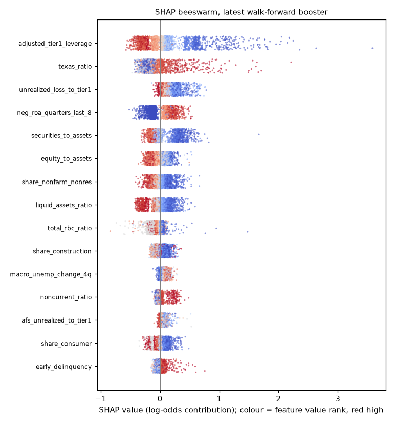

# SHAP driver summary (walk-forward gradient boosters)

`shap.TreeExplainer` on the per-year `gbdt` walk-forward models (2008-2024, each explaining its own test rows) and on the production model (the 2024 booster scoring every quarter after 2024). Values are log-odds contributions; `mean_abs_shap` is the mean |SHAP| over a year's rows, pooled as the plain average over test years. The `drivers` table keeps the five largest positive and five largest negative contributions per bank-quarter.

## Mean |SHAP| per feature, pooled and 2009 versus 2023 (top 20)

| feature | mean_abs_shap | share | mean_abs_2009 | mean_abs_2023 |
|---|---|---|---|---|
| texas_ratio | 0.2051 | 0.0716 | 0.3836 | 0.1374 |
| adjusted_tier1_leverage | 0.1598 | 0.0558 | 0.0947 | 0.2721 |
| securities_to_assets | 0.1402 | 0.0489 | 0.1566 | 0.1286 |
| macro_hpi_change_4q | 0.1285 | 0.0448 | 0.4155 | 0.0574 |
| macro_fedfunds_change_4q | 0.1211 | 0.0423 | 0.1896 | 0.2843 |
| neg_roa_quarters_last_8 | 0.1201 | 0.0419 | 0.0272 | 0.1450 |
| equity_to_assets | 0.1052 | 0.0367 | 0.0494 | 0.1039 |
| macro_unemp_change_4q | 0.0774 | 0.0270 | 0.0245 | 0.0387 |
| total_rbc_ratio | 0.0728 | 0.0254 | 0.0248 | 0.0497 |
| share_construction | 0.0667 | 0.0233 | 0.0174 | 0.0240 |
| unrealized_loss_to_tier1 | 0.0653 | 0.0228 | 0.0280 | 0.1602 |
| noncurrent_ratio | 0.0641 | 0.0224 | 0.0808 | 0.0483 |
| d4q_equity_to_assets | 0.0641 | 0.0224 | 0.0373 | 0.0309 |
| share_nonfarm_nonres | 0.0624 | 0.0218 | 0.0916 | 0.0571 |
| d4q_texas_ratio | 0.0623 | 0.0218 | 0.0379 | 0.0449 |
| early_delinquency | 0.0529 | 0.0185 | 0.0347 | 0.0297 |
| log_assets | 0.0507 | 0.0177 | 0.0734 | 0.0424 |
| liquid_assets_ratio | 0.0490 | 0.0171 | 0.0665 | 0.0762 |
| roa_q | 0.0440 | 0.0154 | 0.1096 | 0.0292 |
| brokered_share | 0.0425 | 0.0148 | 0.1016 | 0.0197 |

Shift in mean |SHAP| from 2009 to 2023: rose most for `adjusted_tier1_leverage` (+0.177), `unrealized_loss_to_tier1` (+0.132), `neg_roa_quarters_last_8` (+0.118); fell most for `macro_hpi_change_4q` (-0.358), `texas_ratio` (-0.246), `region_west` (-0.086). The crisis-year booster leans on credit quality and the housing cycle, the recent one on rate sensitivity (unrealised losses, the funds-rate change) and capital.

## Feature-importance smoke test (spec rule 6.6)

Largest share of the total mean |SHAP|: `texas_ratio` at 7.2%; the top three together carry 17.6%. Threshold 40%: no feature is flagged; importance is spread across capital, asset-quality, earnings and sensitivity ratios, with no single field acting as a failure marker.

## Per-year top feature

| year | top_feature | top_share | second_feature | third_feature |
|---|---|---|---|---|
| 2008 | share_construction | 0.1477 | share_nonfarm_nonres | macro_hpi_change_4q |
| 2009 | macro_hpi_change_4q | 0.1156 | texas_ratio | macro_fedfunds_change_4q |
| 2010 | macro_hpi_change_4q | 0.0877 | adjusted_tier1_leverage | securities_to_assets |
| 2011 | texas_ratio | 0.1212 | macro_hpi_change_4q | npa_to_assets |
| 2012 | texas_ratio | 0.0895 | npa_to_assets | adjusted_tier1_leverage |
| 2013 | texas_ratio | 0.0908 | securities_to_assets | neg_roa_quarters_last_8 |
| 2014 | texas_ratio | 0.0919 | securities_to_assets | equity_to_assets |
| 2015 | texas_ratio | 0.0868 | neg_roa_quarters_last_8 | total_rbc_ratio |
| 2016 | texas_ratio | 0.1086 | equity_to_assets | neg_roa_quarters_last_8 |
| 2017 | texas_ratio | 0.1036 | neg_roa_quarters_last_8 | macro_fedfunds_change_4q |
| 2018 | neg_roa_quarters_last_8 | 0.0870 | texas_ratio | securities_to_assets |
| 2019 | texas_ratio | 0.0910 | securities_to_assets | neg_roa_quarters_last_8 |
| 2020 | texas_ratio | 0.0744 | macro_fedfunds_change_4q | neg_roa_quarters_last_8 |
| 2021 | texas_ratio | 0.0954 | securities_to_assets | neg_roa_quarters_last_8 |
| 2022 | macro_fedfunds_change_4q | 0.1063 | adjusted_tier1_leverage | d4q_unrealized_loss_to_tier1 |
| 2023 | macro_fedfunds_change_4q | 0.1073 | adjusted_tier1_leverage | unrealized_loss_to_tier1 |
| 2024 | adjusted_tier1_leverage | 0.0938 | texas_ratio | unrealized_loss_to_tier1 |
| production | texas_ratio | 0.0805 | adjusted_tier1_leverage | neg_roa_quarters_last_8 |

