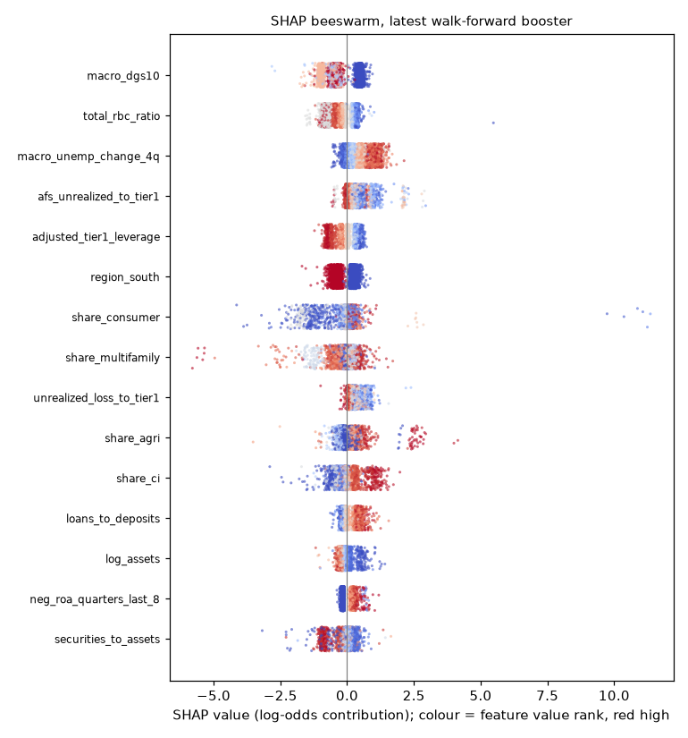

# SHAP driver summary (walk-forward gradient boosters)

`shap.TreeExplainer` on the per-year `gbdt_mono` walk-forward models (2008-2024, each explaining its own test rows) and on the production model (the 2024 booster scoring every quarter after 2024). Values are log-odds contributions; `mean_abs_shap` is the mean |SHAP| over a year's rows, pooled as the plain average over test years, and `share` is the per-year normalised importance: each year's mean |SHAP| divided by that year's total, then averaged over years, so a booster on a larger log-odds scale (the four-failure 2020 fit) counts as one year like every other. The `drivers` table keeps the five largest positive and five largest negative contributions per bank-quarter.

## Mean |SHAP| per feature, pooled and 2009 versus 2023 (top 20)

| feature | mean_abs_shap | share | mean_abs_2009 | mean_abs_2023 |
|---|---|---|---|---|
| texas_ratio | 0.1874 | 0.0666 | 0.0680 | 0.1686 |
| macro_unemp_change_4q | 0.2294 | 0.0621 | 0.1940 | 0.1226 |
| securities_to_assets | 0.1679 | 0.0536 | 0.2547 | 0.1713 |
| total_rbc_ratio | 0.1629 | 0.0528 | 0.0101 | 0.1744 |
| macro_hpi_change_4q | 0.2208 | 0.0500 | 1.0706 | 0.0862 |
| macro_dgs10 | 0.1776 | 0.0498 | 0.1019 | 0.1726 |
| neg_roa_quarters_last_8 | 0.1342 | 0.0419 | 0.0869 | 0.1599 |
| adjusted_tier1_leverage | 0.1574 | 0.0409 | 0.2922 | 0.1920 |
| d4q_texas_ratio | 0.1102 | 0.0325 | 0.2846 | 0.0756 |
| equity_to_assets | 0.0925 | 0.0304 | 0.0772 | 0.0887 |
| log_assets | 0.0998 | 0.0265 | 0.0872 | 0.0720 |
| early_delinquency | 0.0806 | 0.0252 | 0.0858 | 0.0453 |
| roa_q | 0.0668 | 0.0250 | 0.0028 | 0.0732 |
| large_time_deposit_share | 0.0799 | 0.0246 | 0.0083 | 0.0909 |
| d4q_equity_to_assets | 0.0654 | 0.0222 | 0.0097 | 0.0535 |
| share_consumer | 0.0771 | 0.0202 | 0.0347 | 0.0620 |
| share_agri | 0.0823 | 0.0201 | 0.0892 | 0.0691 |
| afs_unrealized_to_tier1 | 0.0769 | 0.0181 | 0.1485 | 0.1976 |
| bkclass_NM | 0.0680 | 0.0178 | 0.0648 | 0.0376 |
| brokered_share | 0.0548 | 0.0175 | 0.1074 | 0.0416 |

Shift in mean |SHAP| from 2009 to 2023: rose most for `total_rbc_ratio` (+0.164), `texas_ratio` (+0.101), `large_time_deposit_share` (+0.083); fell most for `macro_hpi_change_4q` (-0.984), `d4q_texas_ratio` (-0.209), `bank_age_years` (-0.170). The crisis-year booster leans on credit quality and the housing cycle, the recent one on rate sensitivity (unrealised losses, the funds-rate change) and capital.

## Feature-importance smoke test (spec rule 6.6)

Largest per-year normalised share: `texas_ratio` at 6.7%; the top three together carry 18.2%. Threshold 40%: no feature is flagged; importance is spread across capital, asset-quality, earnings and sensitivity ratios, with no single field acting as a failure marker.

## Per-year top feature

| year | top_feature | top_share | second_feature | third_feature |
|---|---|---|---|---|
| 2008 | macro_hpi_change_4q | 0.0940 | adjusted_tier1_leverage | log_assets |
| 2009 | macro_hpi_change_4q | 0.1998 | adjusted_tier1_leverage | d4q_texas_ratio |
| 2010 | macro_hpi_change_4q | 0.1492 | texas_ratio | macro_unemp_change_4q |
| 2011 | macro_unemp_change_4q | 0.0859 | macro_hpi_change_4q | adjusted_tier1_leverage |
| 2012 | texas_ratio | 0.0889 | macro_dgs10 | macro_hpi_change_4q |
| 2013 | texas_ratio | 0.1208 | macro_dgs10 | total_rbc_ratio |
| 2014 | texas_ratio | 0.0864 | macro_dgs10 | total_rbc_ratio |
| 2015 | texas_ratio | 0.1115 | total_rbc_ratio | macro_unemp_change_4q |
| 2016 | texas_ratio | 0.0846 | total_rbc_ratio | macro_unemp_change_4q |
| 2017 | texas_ratio | 0.0759 | macro_unemp_change_4q | large_time_deposit_share |
| 2018 | texas_ratio | 0.0804 | total_rbc_ratio | macro_unemp_change_4q |
| 2019 | texas_ratio | 0.0841 | total_rbc_ratio | securities_to_assets |
| 2020 | macro_unemp_change_4q | 0.1072 | securities_to_assets | texas_ratio |
| 2021 | macro_unemp_change_4q | 0.0974 | securities_to_assets | texas_ratio |
| 2022 | macro_hpi_change_4q | 0.0657 | total_rbc_ratio | macro_unemp_change_4q |
| 2023 | afs_unrealized_to_tier1 | 0.0661 | adjusted_tier1_leverage | total_rbc_ratio |
| 2024 | macro_dgs10 | 0.0711 | total_rbc_ratio | macro_unemp_change_4q |
| production | total_rbc_ratio | 0.0744 | macro_dgs10 | macro_unemp_change_4q |

