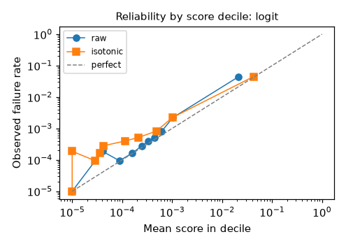
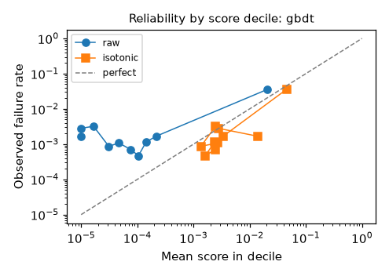
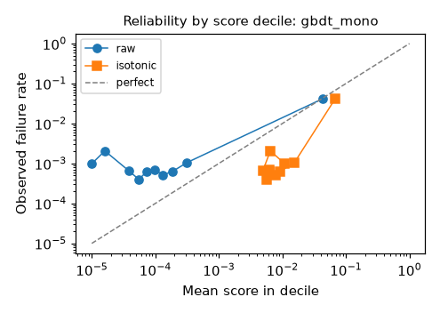
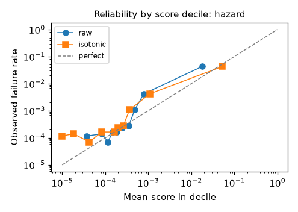
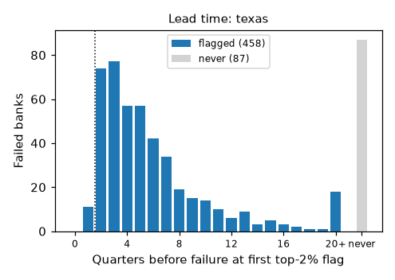
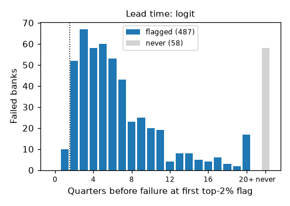
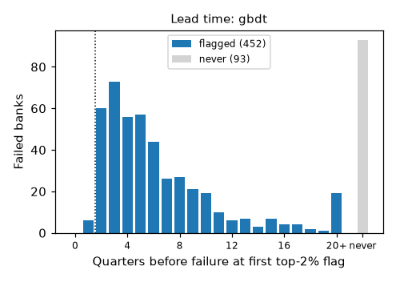
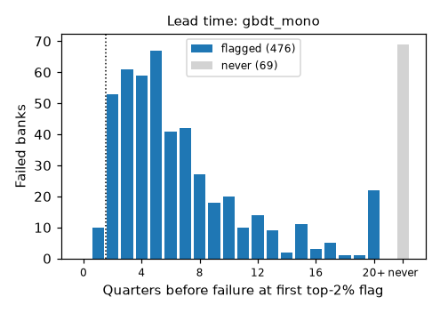
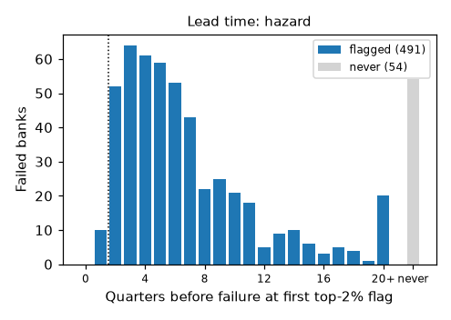

# Walk-forward backtest

One model per test year: for test year Y the training rows are every earlier bank-quarter whose outcome window closed before the first prediction date of Y (report 03-31 of Y plus the 60-day availability lag, spec rule 6.2), the test rows are the label-complete reports dated in Y, and hyper-parameters are re-selected per year on a validation slice inside that year's training period (rule 6.7; `models/walkforward/<Y>/<model>/tuning.json`). `texas` ranks by the Texas ratio without a fit; `logit` is the regularised logit on the v2 features; `gbdt` the unconstrained gradient booster and `gbdt_mono` the same booster under the registry's monotone signs; `hazard` the one-quarter hazard converted with `1 - (1 - h)^H`. Pooled rows score every test year as one ranking. `brier raw` is the mean squared error of the model's own output (n/a for the Texas ranking); `brier calibrated` is that of the isotonic map fitted per year on the last complete label year inside the training window, scored by the year's own model for the logits and by an inner model trained on the years before the slice for the boosters, so no test outcome shapes the map. Generated by `bankcanary metrics-report`.

## Horizon 4q (test years 2008-2024)

### Pooled

| model | n | failures | pr_auc | pr_auc 95% CI | recall@2% | recall@2% 95% CI | roc_auc | brier raw | brier calibrated |
|---|---|---|---|---|---|---|---|---|---|
| hazard | 426019 | 2103 | 0.3268 | [0.294, 0.357] | 0.7038 | [0.679, 0.730] | 0.9575 | 0.0041 | 0.0038 |
| gbdt_mono | 426019 | 2103 | 0.3138 | [0.282, 0.345] | 0.7147 | [0.692, 0.739] | 0.8993 | 0.0045 | 0.0048 |
| logit | 426019 | 2103 | 0.3056 | [0.275, 0.334] | 0.6833 | [0.657, 0.713] | 0.9601 | 0.0041 | 0.0038 |
| gbdt | 426019 | 2103 | 0.2647 | [0.236, 0.297] | 0.6367 | [0.603, 0.663] | 0.8204 | 0.0043 | 0.0044 |
| texas | 426019 | 2103 | 0.2606 | [0.226, 0.298] | 0.7437 | [0.716, 0.771] | 0.9599 | 0.1707 | n/a |

Best pooled PR-AUC at 4q: **hazard** (0.3268, 95% CI [0.294, 0.357]; recall@2% 0.7038). Intervals are percentile intervals from 200 cluster-bootstrap draws that resample banks (certs) with replacement, so the consecutive quarters of one bank move together; two models whose intervals overlap are not distinguished by this backtest.

Prototype 1 fixed-split logit (test 2010-2013, v1 features): PR-AUC 0.3867, recall@2% 0.7143 on 833 failures; not comparable with the pooled rows (one training window, a different test period). The walk-forward logit pools to PR-AUC 0.3056 / recall@2% 0.6833 with one model per year and hyper-parameters re-selected inside each year's training period.

### Per-year results

#### texas (4q)

| year | n | failures | pr_auc | pr_auc 95% CI | recall@2% | recall@2% 95% CI | roc_auc | brier raw | brier calibrated | low confidence |
|---|---|---|---|---|---|---|---|---|---|---|
| 2008 | 33972 | 429 | 0.3506 | [0.288, 0.427] | 0.5408 | [0.492, 0.606] | 0.9392 | 0.0982 | n/a |  |
| 2009 | 32811 | 679 | 0.5714 | [0.516, 0.626] | 0.5567 | [0.511, 0.606] | 0.9611 | 0.2532 | n/a |  |
| 2010 | 31431 | 408 | 0.4840 | [0.417, 0.566] | 0.6471 | [0.599, 0.716] | 0.9692 | 0.2971 | n/a |  |
| 2011 | 30165 | 231 | 0.4171 | [0.329, 0.530] | 0.7749 | [0.676, 0.854] | 0.9776 | 0.3055 | n/a |  |
| 2012 | 29130 | 121 | 0.3574 | [0.246, 0.527] | 0.9091 | [0.827, 0.965] | 0.9894 | 0.2462 | n/a |  |
| 2013 | 27970 | 73 | 0.1659 | [0.081, 0.309] | 0.7123 | [0.527, 0.864] | 0.9569 | 0.2004 | n/a |  |
| 2014 | 26792 | 37 | 0.1225 | [0.044, 0.283] | 0.8649 | [0.713, 0.974] | 0.9861 | 0.1335 | n/a |  |
| 2015 | 25517 | 24 | 0.1152 | [0.039, 0.252] | 0.9167 | [0.666, 1.000] | 0.9753 | 0.0863 | n/a |  |
| 2016 | 24351 | 28 | 0.1038 | [0.044, 0.234] | 0.8214 | [0.608, 0.967] | 0.9533 | 0.0856 | n/a |  |
| 2017 | 23321 | 5 | 0.0112 | [0.000, 0.067] | 0.4000 | [0.000, 1.000] | 0.4271 | 0.0580 | n/a | yes |
| 2018 | 22301 | 10 | 0.0219 | [0.003, 0.078] | 0.7000 | [0.250, 1.000] | 0.7799 | 0.0422 | n/a |  |
| 2019 | 21362 | 18 | 0.3994 | [0.072, 0.747] | 0.9444 | [0.773, 1.000] | 0.9442 | 0.0379 | n/a |  |
| 2020 | 20475 | 4 | 0.6506 | [0.098, 1.000] | 1.0000 | [1.000, 1.000] | 0.9997 | 0.0218 | n/a | yes |
| 2021 | 19942 | 0 | n/a | n/a | n/a | n/a | n/a | 0.0149 | n/a | yes |
| 2022 | 19285 | 17 | 0.0035 | [0.000, 0.027] | 0.1176 | [0.000, 0.574] | 0.5578 | 0.3112 | n/a |  |
| 2023 | 18796 | 10 | 0.0068 | [0.001, 0.035] | 0.2000 | [0.000, 0.762] | 0.8578 | 0.3923 | n/a |  |
| 2024 | 18398 | 9 | 0.0031 | [0.000, 0.038] | 0.1111 | [0.000, 0.630] | 0.6006 | 0.2525 | n/a | yes |
| pooled | 426019 | 2103 | 0.2606 | [0.226, 0.298] | 0.7437 | [0.716, 0.771] | 0.9599 | 0.1707 | n/a |  |

#### logit (4q)

| year | n | failures | pr_auc | pr_auc 95% CI | recall@2% | recall@2% 95% CI | roc_auc | brier raw | brier calibrated | low confidence |
|---|---|---|---|---|---|---|---|---|---|---|
| 2008 | 33972 | 429 | 0.3025 | [0.248, 0.361] | 0.4918 | [0.452, 0.546] | 0.9406 | 0.0126 | 0.0121 |  |
| 2009 | 32811 | 679 | 0.4172 | [0.376, 0.464] | 0.4242 | [0.389, 0.463] | 0.9596 | 0.0186 | 0.0153 |  |
| 2010 | 31431 | 408 | 0.4590 | [0.394, 0.529] | 0.6176 | [0.571, 0.673] | 0.9719 | 0.0091 | 0.0089 |  |
| 2011 | 30165 | 231 | 0.5106 | [0.430, 0.589] | 0.8225 | [0.752, 0.875] | 0.9889 | 0.0051 | 0.0050 |  |
| 2012 | 29130 | 121 | 0.4854 | [0.386, 0.608] | 0.9421 | [0.902, 0.981] | 0.9944 | 0.0030 | 0.0030 |  |
| 2013 | 27970 | 73 | 0.3684 | [0.204, 0.542] | 0.8493 | [0.718, 0.977] | 0.9689 | 0.0020 | 0.0020 |  |
| 2014 | 26792 | 37 | 0.4364 | [0.264, 0.678] | 0.9730 | [0.895, 1.000] | 0.9965 | 0.0010 | 0.0010 |  |
| 2015 | 25517 | 24 | 0.2671 | [0.134, 0.524] | 1.0000 | [1.000, 1.000] | 0.9981 | 0.0008 | 0.0009 |  |
| 2016 | 24351 | 28 | 0.5337 | [0.281, 0.800] | 0.9643 | [0.857, 1.000] | 0.9755 | 0.0008 | 0.0008 |  |
| 2017 | 23321 | 5 | 0.0454 | [0.000, 0.450] | 0.4000 | [0.000, 1.000] | 0.5796 | 0.0003 | 0.0003 | yes |
| 2018 | 22301 | 10 | 0.0961 | [0.014, 0.331] | 0.7000 | [0.250, 1.000] | 0.9223 | 0.0005 | 0.0006 |  |
| 2019 | 21362 | 18 | 0.5079 | [0.176, 0.862] | 0.9444 | [0.773, 1.000] | 0.9901 | 0.0006 | 0.0007 |  |
| 2020 | 20475 | 4 | 0.8750 | [0.667, 1.000] | 1.0000 | [1.000, 1.000] | 1.0000 | 0.0001 | 0.0002 | yes |
| 2021 | 19942 | 0 | n/a | n/a | n/a | n/a | n/a | 0.0000 | 0.0000 | yes |
| 2022 | 19285 | 17 | 0.0219 | [0.001, 0.210] | 0.2353 | [0.000, 0.754] | 0.7511 | 0.0009 | 0.0009 |  |
| 2023 | 18796 | 10 | 0.0417 | [0.000, 0.278] | 0.5000 | [0.000, 1.000] | 0.8421 | 0.0005 | 0.0006 |  |
| 2024 | 18398 | 9 | 0.1117 | [0.000, 0.630] | 0.1111 | [0.000, 0.630] | 0.6101 | 0.0005 | 0.0006 | yes |
| pooled | 426019 | 2103 | 0.3056 | [0.275, 0.334] | 0.6833 | [0.657, 0.713] | 0.9601 | 0.0041 | 0.0038 |  |

#### gbdt (4q)

| year | n | failures | pr_auc | pr_auc 95% CI | recall@2% | recall@2% 95% CI | roc_auc | brier raw | brier calibrated | low confidence |
|---|---|---|---|---|---|---|---|---|---|---|
| 2008 | 33972 | 429 | 0.1102 | [0.086, 0.142] | 0.2727 | [0.233, 0.320] | 0.7454 | 0.0126 | 0.0124 |  |
| 2009 | 32811 | 679 | 0.3863 | [0.341, 0.447] | 0.4197 | [0.382, 0.467] | 0.9563 | 0.0189 | 0.0159 |  |
| 2010 | 31431 | 408 | 0.4377 | [0.378, 0.501] | 0.6324 | [0.576, 0.689] | 0.9594 | 0.0108 | 0.0119 |  |
| 2011 | 30165 | 231 | 0.5422 | [0.454, 0.629] | 0.8571 | [0.787, 0.925] | 0.9929 | 0.0048 | 0.0084 |  |
| 2012 | 29130 | 121 | 0.4626 | [0.347, 0.592] | 0.9587 | [0.902, 0.984] | 0.9952 | 0.0030 | 0.0030 |  |
| 2013 | 27970 | 73 | 0.4074 | [0.240, 0.602] | 0.8767 | [0.750, 0.984] | 0.9834 | 0.0019 | 0.0019 |  |
| 2014 | 26792 | 37 | 0.5152 | [0.304, 0.690] | 0.9730 | [0.900, 1.000] | 0.9969 | 0.0010 | 0.0009 |  |
| 2015 | 25517 | 24 | 0.3090 | [0.136, 0.641] | 1.0000 | [1.000, 1.000] | 0.9981 | 0.0008 | 0.0008 |  |
| 2016 | 24351 | 28 | 0.4090 | [0.208, 0.686] | 0.9286 | [0.800, 1.000] | 0.9725 | 0.0009 | 0.0009 |  |
| 2017 | 23321 | 5 | 0.0664 | [0.000, 0.538] | 0.4000 | [0.000, 1.000] | 0.7841 | 0.0002 | 0.0002 | yes |
| 2018 | 22301 | 10 | 0.1131 | [0.018, 0.346] | 0.7000 | [0.250, 1.000] | 0.9478 | 0.0006 | 0.0006 |  |
| 2019 | 21362 | 18 | 0.4509 | [0.198, 0.802] | 0.9444 | [0.773, 1.000] | 0.9856 | 0.0006 | 0.0006 |  |
| 2020 | 20475 | 4 | 0.0074 | [0.000, 0.040] | 0.2500 | [0.000, 0.500] | 0.5227 | 0.0014 | 0.0005 | yes |
| 2021 | 19942 | 0 | n/a | n/a | n/a | n/a | n/a | 0.0000 | 0.0001 | yes |
| 2022 | 19285 | 17 | 0.0092 | [0.001, 0.094] | 0.1176 | [0.000, 0.574] | 0.7719 | 0.0009 | 0.0009 |  |
| 2023 | 18796 | 10 | 0.1289 | [0.000, 0.672] | 0.7000 | [0.000, 1.000] | 0.8483 | 0.0005 | 0.0005 |  |
| 2024 | 18398 | 9 | 0.0578 | [0.001, 0.506] | 0.1111 | [0.000, 0.630] | 0.8879 | 0.0005 | 0.0005 | yes |
| pooled | 426019 | 2103 | 0.2647 | [0.236, 0.297] | 0.6367 | [0.603, 0.663] | 0.8204 | 0.0043 | 0.0044 |  |

#### gbdt_mono (4q)

| year | n | failures | pr_auc | pr_auc 95% CI | recall@2% | recall@2% 95% CI | roc_auc | brier raw | brier calibrated | low confidence |
|---|---|---|---|---|---|---|---|---|---|---|
| 2008 | 33972 | 429 | 0.2020 | [0.159, 0.250] | 0.4289 | [0.382, 0.492] | 0.8744 | 0.0123 | 0.0121 |  |
| 2009 | 32811 | 679 | 0.3414 | [0.304, 0.390] | 0.3741 | [0.336, 0.426] | 0.9538 | 0.0188 | 0.0174 |  |
| 2010 | 31431 | 408 | 0.4544 | [0.398, 0.521] | 0.6471 | [0.585, 0.709] | 0.9786 | 0.0113 | 0.0175 |  |
| 2011 | 30165 | 231 | 0.4245 | [0.348, 0.505] | 0.8009 | [0.746, 0.856] | 0.9736 | 0.0075 | 0.0072 |  |
| 2012 | 29130 | 121 | 0.4796 | [0.349, 0.598] | 0.9421 | [0.892, 0.988] | 0.9950 | 0.0031 | 0.0030 |  |
| 2013 | 27970 | 73 | 0.3906 | [0.246, 0.575] | 0.8767 | [0.760, 0.985] | 0.9811 | 0.0019 | 0.0019 |  |
| 2014 | 26792 | 37 | 0.4484 | [0.249, 0.666] | 0.9730 | [0.900, 1.000] | 0.9943 | 0.0010 | 0.0010 |  |
| 2015 | 25517 | 24 | 0.2998 | [0.120, 0.581] | 1.0000 | [1.000, 1.000] | 0.9978 | 0.0009 | 0.0009 |  |
| 2016 | 24351 | 28 | 0.4653 | [0.250, 0.765] | 0.9286 | [0.823, 1.000] | 0.9717 | 0.0008 | 0.0008 |  |
| 2017 | 23321 | 5 | 0.2402 | [0.000, 0.770] | 0.4000 | [0.000, 1.000] | 0.6752 | 0.0002 | 0.0002 | yes |
| 2018 | 22301 | 10 | 0.1330 | [0.018, 0.427] | 0.7000 | [0.250, 1.000] | 0.9281 | 0.0005 | 0.0006 |  |
| 2019 | 21362 | 18 | 0.5376 | [0.274, 0.827] | 0.9444 | [0.773, 1.000] | 0.9935 | 0.0006 | 0.0008 |  |
| 2020 | 20475 | 4 | 0.5521 | [0.200, 1.000] | 1.0000 | [1.000, 1.000] | 0.9998 | 0.0002 | 0.0001 | yes |
| 2021 | 19942 | 0 | n/a | n/a | n/a | n/a | n/a | 0.0001 | 0.0002 | yes |
| 2022 | 19285 | 17 | 0.0121 | [0.001, 0.128] | 0.1176 | [0.000, 0.574] | 0.6943 | 0.0009 | 0.0009 |  |
| 2023 | 18796 | 10 | 0.1761 | [0.001, 0.750] | 0.6000 | [0.000, 1.000] | 0.9138 | 0.0005 | 0.0005 |  |
| 2024 | 18398 | 9 | 0.1119 | [0.000, 0.631] | 0.1111 | [0.000, 0.630] | 0.5519 | 0.0006 | 0.0006 | yes |
| pooled | 426019 | 2103 | 0.3138 | [0.282, 0.345] | 0.7147 | [0.692, 0.739] | 0.8993 | 0.0045 | 0.0048 |  |

#### hazard (4q)

| year | n | failures | pr_auc | pr_auc 95% CI | recall@2% | recall@2% 95% CI | roc_auc | brier raw | brier calibrated | low confidence |
|---|---|---|---|---|---|---|---|---|---|---|
| 2008 | 33972 | 429 | 0.3221 | [0.267, 0.385] | 0.5198 | [0.474, 0.573] | 0.9443 | 0.0126 | 0.0120 |  |
| 2009 | 32811 | 679 | 0.4559 | [0.413, 0.502] | 0.4433 | [0.406, 0.486] | 0.9614 | 0.0189 | 0.0152 |  |
| 2010 | 31431 | 408 | 0.4897 | [0.429, 0.554] | 0.6471 | [0.599, 0.692] | 0.9713 | 0.0091 | 0.0089 |  |
| 2011 | 30165 | 231 | 0.5506 | [0.464, 0.636] | 0.8701 | [0.811, 0.928] | 0.9930 | 0.0047 | 0.0049 |  |
| 2012 | 29130 | 121 | 0.5342 | [0.421, 0.669] | 0.9669 | [0.932, 0.992] | 0.9957 | 0.0029 | 0.0026 |  |
| 2013 | 27970 | 73 | 0.4190 | [0.254, 0.610] | 0.8767 | [0.747, 0.989] | 0.9728 | 0.0020 | 0.0019 |  |
| 2014 | 26792 | 37 | 0.4237 | [0.260, 0.681] | 0.9730 | [0.900, 1.000] | 0.9953 | 0.0010 | 0.0010 |  |
| 2015 | 25517 | 24 | 0.3305 | [0.135, 0.631] | 1.0000 | [1.000, 1.000] | 0.9983 | 0.0008 | 0.0008 |  |
| 2016 | 24351 | 28 | 0.4899 | [0.275, 0.786] | 0.8571 | [0.652, 1.000] | 0.9672 | 0.0008 | 0.0008 |  |
| 2017 | 23321 | 5 | 0.0446 | [0.000, 0.389] | 0.4000 | [0.000, 1.000] | 0.6557 | 0.0003 | 0.0003 | yes |
| 2018 | 22301 | 10 | 0.0750 | [0.010, 0.264] | 0.7000 | [0.250, 1.000] | 0.9031 | 0.0005 | 0.0005 |  |
| 2019 | 21362 | 18 | 0.4849 | [0.153, 0.859] | 0.9444 | [0.773, 1.000] | 0.9763 | 0.0007 | 0.0008 |  |
| 2020 | 20475 | 4 | 0.8269 | [0.567, 1.000] | 1.0000 | [1.000, 1.000] | 0.9999 | 0.0001 | 0.0001 | yes |
| 2021 | 19942 | 0 | n/a | n/a | n/a | n/a | n/a | 0.0000 | 0.0000 | yes |
| 2022 | 19285 | 17 | 0.0048 | [0.000, 0.032] | 0.2353 | [0.000, 0.754] | 0.4751 | 0.0009 | 0.0009 |  |
| 2023 | 18796 | 10 | 0.0116 | [0.000, 0.044] | 0.5000 | [0.000, 0.905] | 0.8686 | 0.0005 | 0.0006 |  |
| 2024 | 18398 | 9 | 0.0283 | [0.000, 0.336] | 0.1111 | [0.000, 0.630] | 0.5864 | 0.0005 | 0.0005 | yes |
| pooled | 426019 | 2103 | 0.3268 | [0.294, 0.357] | 0.7038 | [0.679, 0.730] | 0.9575 | 0.0041 | 0.0038 |  |

Years flagged low confidence hold fewer than 10 failures; a year with no failure has undefined ranking metrics and still counts in the pooled row through its non-failing banks.

### Calibration

The map for test year Y is learned on the last complete label year inside Y's training window (widened backwards while it holds fewer than five failures). The logit and the hazard score that slice with Y's own full-window model, so the map is learned on the score scale it is applied to (in-sample for those rows, which a regularised logit on hundreds of thousands of rows tolerates); the boosters separate their training rows perfectly and use an inner model fitted on the years before the slice instead, so their map is applied to a scale it never saw and can inherit the inner model's plateaus (`calibration.SLICE_SCORER_BY_MODEL`). Pooled deciles mix years, so a model whose raw scale drifts between years shows a non-monotone raw curve even when every single year ranks well.

#### logit (4q)

Pooled Brier raw 0.0041 against calibrated 0.0038; pooled mean score 0.0025 raw and 0.0044 calibrated against a failure rate of 0.0049. Calibration worsens the Brier score in 8 of 17 years (2014, 2015, 2018, 2019, 2020, 2021, 2023, 2024).

| year | failures | failure rate | mean raw | mean calibrated | brier raw | brier calibrated | low confidence |
|---|---|---|---|---|---|---|---|
| 2008 | 429 | 0.0126 | 0.0005 | 0.0052 | 0.0126 | 0.0121 |  |
| 2009 | 679 | 0.0207 | 0.0046 | 0.0225 | 0.0186 | 0.0153 |  |
| 2010 | 408 | 0.0130 | 0.0113 | 0.0145 | 0.0091 | 0.0089 |  |
| 2011 | 231 | 0.0077 | 0.0074 | 0.0069 | 0.0051 | 0.0050 |  |
| 2012 | 121 | 0.0042 | 0.0032 | 0.0028 | 0.0030 | 0.0030 |  |
| 2013 | 73 | 0.0026 | 0.0020 | 0.0016 | 0.0020 | 0.0020 |  |
| 2014 | 37 | 0.0014 | 0.0012 | 0.0012 | 0.0010 | 0.0010 |  |
| 2015 | 24 | 0.0009 | 0.0011 | 0.0010 | 0.0008 | 0.0009 |  |
| 2016 | 28 | 0.0011 | 0.0006 | 0.0006 | 0.0008 | 0.0008 |  |
| 2017 | 5 | 0.0002 | 0.0004 | 0.0003 | 0.0003 | 0.0003 | yes |
| 2018 | 10 | 0.0004 | 0.0004 | 0.0006 | 0.0005 | 0.0006 |  |
| 2019 | 18 | 0.0008 | 0.0006 | 0.0003 | 0.0006 | 0.0007 |  |
| 2020 | 4 | 0.0002 | 0.0008 | 0.0007 | 0.0001 | 0.0002 | yes |
| 2021 | 0 | 0.0000 | 0.0001 | 0.0001 | 0.0000 | 0.0000 | yes |
| 2022 | 17 | 0.0009 | 0.0002 | 0.0001 | 0.0009 | 0.0009 |  |
| 2023 | 10 | 0.0005 | 0.0003 | 0.0002 | 0.0005 | 0.0006 |  |
| 2024 | 9 | 0.0005 | 0.0010 | 0.0033 | 0.0005 | 0.0006 | yes |
| pooled | 2103 | 0.0049 | 0.0025 | 0.0044 | 0.0041 | 0.0038 |  |

Reliability by raw-score decile, pooled over every test year:

| decile | n | failures | mean raw | mean calibrated | observed rate |
|---|---|---|---|---|---|
| 1 | 42602 | 0 | 0.00001 | 0.0000 | 0.00000 |
| 2 | 42602 | 8 | 0.00004 | 0.0000 | 0.00019 |
| 3 | 42602 | 4 | 0.00009 | 0.0000 | 0.00009 |
| 4 | 42602 | 7 | 0.00016 | 0.0000 | 0.00016 |
| 5 | 42602 | 12 | 0.00025 | 0.0000 | 0.00028 |
| 6 | 42601 | 17 | 0.00034 | 0.0001 | 0.00040 |
| 7 | 42602 | 22 | 0.00045 | 0.0002 | 0.00052 |
| 8 | 42602 | 35 | 0.00062 | 0.0005 | 0.00082 |
| 9 | 42602 | 95 | 0.00104 | 0.0010 | 0.00223 |
| 10 | 42602 | 1903 | 0.02152 | 0.0424 | 0.04467 |

#### gbdt (4q)

Pooled Brier raw 0.0043 against calibrated 0.0044; pooled mean score 0.0021 raw and 0.0079 calibrated against a failure rate of 0.0049. Calibration worsens the Brier score in 7 of 17 years (2010, 2011, 2012, 2013, 2021, 2022, 2024).

| year | failures | failure rate | mean raw | mean calibrated | brier raw | brier calibrated | low confidence |
|---|---|---|---|---|---|---|---|
| 2008 | 429 | 0.0126 | 0.0001 | 0.0008 | 0.0126 | 0.0124 |  |
| 2009 | 679 | 0.0207 | 0.0023 | 0.0250 | 0.0189 | 0.0159 |  |
| 2010 | 408 | 0.0130 | 0.0107 | 0.0252 | 0.0108 | 0.0119 |  |
| 2011 | 231 | 0.0077 | 0.0060 | 0.0406 | 0.0048 | 0.0084 |  |
| 2012 | 121 | 0.0042 | 0.0032 | 0.0077 | 0.0030 | 0.0030 |  |
| 2013 | 73 | 0.0026 | 0.0023 | 0.0020 | 0.0019 | 0.0019 |  |
| 2014 | 37 | 0.0014 | 0.0011 | 0.0014 | 0.0010 | 0.0009 |  |
| 2015 | 24 | 0.0009 | 0.0011 | 0.0010 | 0.0008 | 0.0008 |  |
| 2016 | 28 | 0.0011 | 0.0004 | 0.0006 | 0.0009 | 0.0009 |  |
| 2017 | 5 | 0.0002 | 0.0002 | 0.0002 | 0.0002 | 0.0002 | yes |
| 2018 | 10 | 0.0004 | 0.0005 | 0.0009 | 0.0006 | 0.0006 |  |
| 2019 | 18 | 0.0008 | 0.0006 | 0.0006 | 0.0006 | 0.0006 |  |
| 2020 | 4 | 0.0002 | 0.0019 | 0.0024 | 0.0014 | 0.0005 | yes |
| 2021 | 0 | 0.0000 | 0.0001 | 0.0005 | 0.0000 | 0.0001 | yes |
| 2022 | 17 | 0.0009 | 0.0002 | 0.0001 | 0.0009 | 0.0009 |  |
| 2023 | 10 | 0.0005 | 0.0002 | 0.0000 | 0.0005 | 0.0005 |  |
| 2024 | 9 | 0.0005 | 0.0003 | 0.0013 | 0.0005 | 0.0005 | yes |
| pooled | 2103 | 0.0049 | 0.0021 | 0.0079 | 0.0043 | 0.0044 |  |

Reliability by raw-score decile, pooled over every test year:

| decile | n | failures | mean raw | mean calibrated | observed rate |
|---|---|---|---|---|---|
| 1 | 42602 | 71 | 0.00000 | 0.0142 | 0.00167 |
| 2 | 42602 | 120 | 0.00000 | 0.0028 | 0.00282 |
| 3 | 42602 | 137 | 0.00002 | 0.0025 | 0.00322 |
| 4 | 42602 | 37 | 0.00003 | 0.0014 | 0.00087 |
| 5 | 42602 | 46 | 0.00005 | 0.0027 | 0.00108 |
| 6 | 42601 | 30 | 0.00008 | 0.0024 | 0.00070 |
| 7 | 42602 | 20 | 0.00010 | 0.0016 | 0.00047 |
| 8 | 42602 | 49 | 0.00014 | 0.0024 | 0.00115 |
| 9 | 42602 | 72 | 0.00022 | 0.0034 | 0.00169 |
| 10 | 42602 | 1521 | 0.02061 | 0.0453 | 0.03570 |

#### gbdt_mono (4q)

Pooled Brier raw 0.0045 against calibrated 0.0048; pooled mean score 0.0044 raw and 0.0141 calibrated against a failure rate of 0.0049. Calibration worsens the Brier score in 8 of 17 years (2010, 2013, 2014, 2017, 2018, 2019, 2021, 2022).

| year | failures | failure rate | mean raw | mean calibrated | brier raw | brier calibrated | low confidence |
|---|---|---|---|---|---|---|---|
| 2008 | 429 | 0.0126 | 0.0005 | 0.0018 | 0.0123 | 0.0121 |  |
| 2009 | 679 | 0.0207 | 0.0222 | 0.0471 | 0.0188 | 0.0174 |  |
| 2010 | 408 | 0.0130 | 0.0169 | 0.1003 | 0.0113 | 0.0175 |  |
| 2011 | 231 | 0.0077 | 0.0092 | 0.0298 | 0.0075 | 0.0072 |  |
| 2012 | 121 | 0.0042 | 0.0040 | 0.0042 | 0.0031 | 0.0030 |  |
| 2013 | 73 | 0.0026 | 0.0023 | 0.0020 | 0.0019 | 0.0019 |  |
| 2014 | 37 | 0.0014 | 0.0013 | 0.0013 | 0.0010 | 0.0010 |  |
| 2015 | 24 | 0.0009 | 0.0012 | 0.0012 | 0.0009 | 0.0009 |  |
| 2016 | 28 | 0.0011 | 0.0008 | 0.0008 | 0.0008 | 0.0008 |  |
| 2017 | 5 | 0.0002 | 0.0004 | 0.0004 | 0.0002 | 0.0002 | yes |
| 2018 | 10 | 0.0004 | 0.0005 | 0.0007 | 0.0005 | 0.0006 |  |
| 2019 | 18 | 0.0008 | 0.0005 | 0.0003 | 0.0006 | 0.0008 |  |
| 2020 | 4 | 0.0002 | 0.0004 | 0.0004 | 0.0002 | 0.0001 | yes |
| 2021 | 0 | 0.0000 | 0.0002 | 0.0004 | 0.0001 | 0.0002 | yes |
| 2022 | 17 | 0.0009 | 0.0002 | 0.0003 | 0.0009 | 0.0009 |  |
| 2023 | 10 | 0.0005 | 0.0002 | 0.0001 | 0.0005 | 0.0005 |  |
| 2024 | 9 | 0.0005 | 0.0005 | 0.0013 | 0.0006 | 0.0006 | yes |
| pooled | 2103 | 0.0049 | 0.0044 | 0.0141 | 0.0045 | 0.0048 |  |

Reliability by raw-score decile, pooled over every test year:

| decile | n | failures | mean raw | mean calibrated | observed rate |
|---|---|---|---|---|---|
| 1 | 42602 | 42 | 0.00000 | 0.0109 | 0.00099 |
| 2 | 42602 | 88 | 0.00002 | 0.0065 | 0.00207 |
| 3 | 42602 | 28 | 0.00004 | 0.0049 | 0.00066 |
| 4 | 42602 | 17 | 0.00005 | 0.0056 | 0.00040 |
| 5 | 42602 | 27 | 0.00007 | 0.0061 | 0.00063 |
| 6 | 42601 | 30 | 0.00010 | 0.0063 | 0.00070 |
| 7 | 42602 | 22 | 0.00013 | 0.0077 | 0.00052 |
| 8 | 42602 | 27 | 0.00019 | 0.0092 | 0.00063 |
| 9 | 42602 | 45 | 0.00032 | 0.0155 | 0.00106 |
| 10 | 42602 | 1777 | 0.04313 | 0.0680 | 0.04171 |

#### hazard (4q)

Pooled Brier raw 0.0041 against calibrated 0.0038; pooled mean score 0.0020 raw and 0.0055 calibrated against a failure rate of 0.0049. Calibration worsens the Brier score in 10 of 17 years (2011, 2015, 2017, 2018, 2019, 2020, 2021, 2022, 2023, 2024).

| year | failures | failure rate | mean raw | mean calibrated | brier raw | brier calibrated | low confidence |
|---|---|---|---|---|---|---|---|
| 2008 | 429 | 0.0126 | 0.0005 | 0.0064 | 0.0126 | 0.0120 |  |
| 2009 | 679 | 0.0207 | 0.0041 | 0.0249 | 0.0189 | 0.0152 |  |
| 2010 | 408 | 0.0130 | 0.0090 | 0.0210 | 0.0091 | 0.0089 |  |
| 2011 | 231 | 0.0077 | 0.0064 | 0.0108 | 0.0047 | 0.0049 |  |
| 2012 | 121 | 0.0042 | 0.0025 | 0.0039 | 0.0029 | 0.0026 |  |
| 2013 | 73 | 0.0026 | 0.0014 | 0.0017 | 0.0020 | 0.0019 |  |
| 2014 | 37 | 0.0014 | 0.0011 | 0.0012 | 0.0010 | 0.0010 |  |
| 2015 | 24 | 0.0009 | 0.0009 | 0.0011 | 0.0008 | 0.0008 |  |
| 2016 | 28 | 0.0011 | 0.0006 | 0.0007 | 0.0008 | 0.0008 |  |
| 2017 | 5 | 0.0002 | 0.0004 | 0.0003 | 0.0003 | 0.0003 | yes |
| 2018 | 10 | 0.0004 | 0.0003 | 0.0005 | 0.0005 | 0.0005 |  |
| 2019 | 18 | 0.0008 | 0.0005 | 0.0002 | 0.0007 | 0.0008 |  |
| 2020 | 4 | 0.0002 | 0.0007 | 0.0004 | 0.0001 | 0.0001 | yes |
| 2021 | 0 | 0.0000 | 0.0002 | 0.0002 | 0.0000 | 0.0000 | yes |
| 2022 | 17 | 0.0009 | 0.0003 | 0.0003 | 0.0009 | 0.0009 |  |
| 2023 | 10 | 0.0005 | 0.0004 | 0.0003 | 0.0005 | 0.0006 |  |
| 2024 | 9 | 0.0005 | 0.0005 | 0.0018 | 0.0005 | 0.0005 | yes |
| pooled | 2103 | 0.0049 | 0.0020 | 0.0055 | 0.0041 | 0.0038 |  |

Reliability by raw-score decile, pooled over every test year:

| decile | n | failures | mean raw | mean calibrated | observed rate |
|---|---|---|---|---|---|
| 1 | 42602 | 5 | 0.00004 | 0.0000 | 0.00012 |
| 2 | 42602 | 6 | 0.00008 | 0.0000 | 0.00014 |
| 3 | 42602 | 3 | 0.00012 | 0.0000 | 0.00007 |
| 4 | 42602 | 7 | 0.00015 | 0.0001 | 0.00016 |
| 5 | 42602 | 7 | 0.00019 | 0.0002 | 0.00016 |
| 6 | 42601 | 10 | 0.00025 | 0.0002 | 0.00023 |
| 7 | 42602 | 12 | 0.00035 | 0.0003 | 0.00028 |
| 8 | 42602 | 46 | 0.00049 | 0.0004 | 0.00108 |
| 9 | 42602 | 181 | 0.00079 | 0.0011 | 0.00425 |
| 10 | 42602 | 1826 | 0.01792 | 0.0527 | 0.04286 |

### Lead time

For every bank that failed, the number of calendar quarters between the first report at which it entered the top 2 percent of that quarter's ranking and its failure. The 2009-2012 cohort is the spec's headline; `all` counts every failure with at least one scored quarter before it, including the first test year (which can only be flagged within that year) and failures after the last complete test year (scored only through it), so its lead times are shortened at both ends. Never-flagged banks are in every denominator.

| model | failures | failed banks | flagged before failure | median lead (flagged) | median lead (never = 0) | flagged >= 2 quarters ahead | low confidence |
|---|---|---|---|---|---|---|---|
| texas | 2009-2012 | 440 | 372 (0.8455) | 4.0000 | 4.0000 | 0.8250 |  |
| texas | all | 545 | 458 (0.8404) | 5.0000 | 4.0000 | 0.8202 |  |
| logit | 2009-2012 | 440 | 395 (0.8977) | 5.0000 | 5.0000 | 0.8773 |  |
| logit | all | 545 | 487 (0.8936) | 5.0000 | 5.0000 | 0.8752 |  |
| gbdt | 2009-2012 | 440 | 364 (0.8273) | 4.5000 | 4.0000 | 0.8159 |  |
| gbdt | all | 545 | 452 (0.8294) | 5.0000 | 4.0000 | 0.8183 |  |
| gbdt_mono | 2009-2012 | 440 | 384 (0.8727) | 5.0000 | 4.5000 | 0.8545 |  |
| gbdt_mono | all | 545 | 476 (0.8734) | 5.0000 | 5.0000 | 0.8550 |  |
| hazard | 2009-2012 | 440 | 398 (0.9045) | 5.0000 | 5.0000 | 0.8841 |  |
| hazard | all | 545 | 491 (0.9009) | 5.0000 | 5.0000 | 0.8826 |  |

## Horizon 8q (test years 2008-2023)

### Pooled

| model | n | failures | pr_auc | pr_auc 95% CI | recall@2% | recall@2% 95% CI | roc_auc | brier raw | brier calibrated |
|---|---|---|---|---|---|---|---|---|---|
| hazard | 407621 | 3768 | 0.4113 | [0.382, 0.442] | 0.6598 | [0.634, 0.688] | 0.9416 | 0.0070 | 0.0080 |
| logit | 407621 | 3768 | 0.2566 | [0.225, 0.288] | 0.5207 | [0.493, 0.550] | 0.7447 | 0.0079 | 0.0077 |
| gbdt | 407621 | 3768 | 0.0887 | [0.070, 0.108] | 0.2200 | [0.193, 0.252] | 0.4193 | 0.0088 | 0.0203 |

Best pooled PR-AUC at 8q: **hazard** (0.4113, 95% CI [0.382, 0.442]; recall@2% 0.6598). Intervals are percentile intervals from 200 cluster-bootstrap draws that resample banks (certs) with replacement, so the consecutive quarters of one bank move together; two models whose intervals overlap are not distinguished by this backtest.

### Per-year results

#### logit (8q)

| year | n | failures | pr_auc | pr_auc 95% CI | recall@2% | recall@2% 95% CI | roc_auc | brier raw | brier calibrated | low confidence |
|---|---|---|---|---|---|---|---|---|---|---|
| 2008 | 33972 | 1108 | 0.0719 | [0.057, 0.093] | 0.1011 | [0.082, 0.123] | 0.5881 | 0.0326 | 0.0327 |  |
| 2009 | 32811 | 1087 | 0.4321 | [0.383, 0.483] | 0.3183 | [0.289, 0.357] | 0.9550 | 0.0290 | 0.0258 |  |
| 2010 | 31431 | 639 | 0.4486 | [0.394, 0.517] | 0.4883 | [0.444, 0.535] | 0.9625 | 0.0148 | 0.0149 |  |
| 2011 | 30165 | 352 | 0.4904 | [0.408, 0.554] | 0.6648 | [0.573, 0.714] | 0.9820 | 0.0080 | 0.0079 |  |
| 2012 | 29130 | 194 | 0.4235 | [0.341, 0.550] | 0.7577 | [0.671, 0.851] | 0.9627 | 0.0048 | 0.0048 |  |
| 2013 | 27970 | 110 | 0.3344 | [0.207, 0.479] | 0.7909 | [0.654, 0.919] | 0.9539 | 0.0031 | 0.0030 |  |
| 2014 | 26792 | 61 | 0.2985 | [0.178, 0.476] | 0.9508 | [0.889, 1.000] | 0.9919 | 0.0019 | 0.0019 |  |
| 2015 | 25517 | 52 | 0.2936 | [0.137, 0.556] | 0.8269 | [0.661, 0.964] | 0.9779 | 0.0018 | 0.0017 |  |
| 2016 | 24351 | 33 | 0.3297 | [0.161, 0.665] | 0.7273 | [0.499, 1.000] | 0.9136 | 0.0011 | 0.0011 |  |
| 2017 | 23321 | 15 | 0.0398 | [0.003, 0.160] | 0.3333 | [0.059, 0.716] | 0.6459 | 0.0007 | 0.0007 |  |
| 2018 | 22301 | 28 | 0.2388 | [0.059, 0.501] | 0.7500 | [0.422, 1.000] | 0.9186 | 0.0011 | 0.0011 |  |
| 2019 | 21362 | 22 | 0.5270 | [0.203, 0.902] | 0.9545 | [0.800, 1.000] | 0.9821 | 0.0006 | 0.0006 |  |
| 2020 | 20475 | 4 | 0.8929 | [0.683, 1.000] | 1.0000 | [1.000, 1.000] | 1.0000 | 0.0001 | 0.0002 | yes |
| 2021 | 19942 | 17 | 0.0016 | [0.000, 0.004] | 0.0000 | [0.000, 0.000] | 0.7137 | 0.0009 | 0.0009 |  |
| 2022 | 19285 | 27 | 0.0173 | [0.001, 0.142] | 0.1481 | [0.000, 0.459] | 0.7680 | 0.0014 | 0.0014 |  |
| 2023 | 18796 | 19 | 0.0132 | [0.001, 0.101] | 0.2105 | [0.000, 0.572] | 0.6771 | 0.0010 | 0.0011 |  |
| pooled | 407621 | 3768 | 0.2566 | [0.225, 0.288] | 0.5207 | [0.493, 0.550] | 0.7447 | 0.0079 | 0.0077 |  |

#### gbdt (8q)

| year | n | failures | pr_auc | pr_auc 95% CI | recall@2% | recall@2% 95% CI | roc_auc | brier raw | brier calibrated | low confidence |
|---|---|---|---|---|---|---|---|---|---|---|
| 2008 | 33972 | 1108 | 0.0326 | [0.030, 0.036] | 0.0027 | [0.000, 0.008] | 0.5000 | 0.0326 | 0.0326 |  |
| 2009 | 32811 | 1087 | 0.3836 | [0.343, 0.433] | 0.2962 | [0.270, 0.328] | 0.8972 | 0.0331 | 0.0326 |  |
| 2010 | 31431 | 639 | 0.2975 | [0.256, 0.352] | 0.3474 | [0.309, 0.392] | 0.9471 | 0.0199 | 0.0278 |  |
| 2011 | 30165 | 352 | 0.3618 | [0.289, 0.430] | 0.6080 | [0.545, 0.673] | 0.9849 | 0.0095 | 0.0842 |  |
| 2012 | 29130 | 194 | 0.4364 | [0.345, 0.555] | 0.8299 | [0.750, 0.905] | 0.9768 | 0.0050 | 0.0702 |  |
| 2013 | 27970 | 110 | 0.2917 | [0.183, 0.447] | 0.7909 | [0.653, 0.907] | 0.9515 | 0.0034 | 0.0141 |  |
| 2014 | 26792 | 61 | 0.3634 | [0.221, 0.532] | 0.9016 | [0.791, 0.980] | 0.9935 | 0.0019 | 0.0019 |  |
| 2015 | 25517 | 52 | 0.3677 | [0.203, 0.627] | 0.8269 | [0.666, 0.947] | 0.9841 | 0.0016 | 0.0016 |  |
| 2016 | 24351 | 33 | 0.3605 | [0.174, 0.713] | 0.7879 | [0.522, 1.000] | 0.9414 | 0.0010 | 0.0011 |  |
| 2017 | 23321 | 15 | 0.0419 | [0.006, 0.196] | 0.4667 | [0.190, 0.867] | 0.8714 | 0.0007 | 0.0008 |  |
| 2018 | 22301 | 28 | 0.2372 | [0.051, 0.557] | 0.7143 | [0.400, 1.000] | 0.9475 | 0.0011 | 0.0010 |  |
| 2019 | 21362 | 22 | 0.5549 | [0.220, 0.909] | 0.9545 | [0.800, 1.000] | 0.9931 | 0.0007 | 0.0007 |  |
| 2020 | 20475 | 4 | 0.6429 | [0.211, 1.000] | 1.0000 | [1.000, 1.000] | 0.9999 | 0.0001 | 0.0002 | yes |
| 2021 | 19942 | 17 | 0.0017 | [0.000, 0.004] | 0.0000 | [0.000, 0.000] | 0.7153 | 0.0009 | 0.0009 |  |
| 2022 | 19285 | 27 | 0.0049 | [0.001, 0.014] | 0.0741 | [0.000, 0.200] | 0.7417 | 0.0014 | 0.0015 |  |
| 2023 | 18796 | 19 | 0.0084 | [0.001, 0.055] | 0.2105 | [0.000, 0.572] | 0.7172 | 0.0010 | 0.0010 |  |
| pooled | 407621 | 3768 | 0.0887 | [0.070, 0.108] | 0.2200 | [0.193, 0.252] | 0.4193 | 0.0088 | 0.0203 |  |

#### hazard (8q)

| year | n | failures | pr_auc | pr_auc 95% CI | recall@2% | recall@2% 95% CI | roc_auc | brier raw | brier calibrated | low confidence |
|---|---|---|---|---|---|---|---|---|---|---|
| 2008 | 33972 | 1108 | 0.3727 | [0.329, 0.417] | 0.2987 | [0.273, 0.326] | 0.9029 | 0.0293 | 0.0313 |  |
| 2009 | 32811 | 1087 | 0.5104 | [0.469, 0.553] | 0.3615 | [0.334, 0.393] | 0.9524 | 0.0231 | 0.0254 |  |
| 2010 | 31431 | 639 | 0.5176 | [0.463, 0.581] | 0.5258 | [0.477, 0.570] | 0.9652 | 0.0134 | 0.0174 |  |
| 2011 | 30165 | 352 | 0.5488 | [0.476, 0.621] | 0.7415 | [0.675, 0.805] | 0.9865 | 0.0073 | 0.0112 |  |
| 2012 | 29130 | 194 | 0.4875 | [0.393, 0.617] | 0.7990 | [0.737, 0.895] | 0.9683 | 0.0047 | 0.0046 |  |
| 2013 | 27970 | 110 | 0.4280 | [0.286, 0.579] | 0.8909 | [0.788, 0.979] | 0.9758 | 0.0030 | 0.0028 |  |
| 2014 | 26792 | 61 | 0.3788 | [0.239, 0.577] | 0.9836 | [0.931, 1.000] | 0.9950 | 0.0018 | 0.0017 |  |
| 2015 | 25517 | 52 | 0.3337 | [0.163, 0.594] | 0.8846 | [0.750, 0.980] | 0.9439 | 0.0017 | 0.0017 |  |
| 2016 | 24351 | 33 | 0.4165 | [0.202, 0.712] | 0.7273 | [0.480, 0.927] | 0.9274 | 0.0010 | 0.0010 |  |
| 2017 | 23321 | 15 | 0.0254 | [0.003, 0.136] | 0.4000 | [0.117, 0.803] | 0.7502 | 0.0008 | 0.0008 |  |
| 2018 | 22301 | 28 | 0.2010 | [0.048, 0.458] | 0.6786 | [0.375, 0.969] | 0.8954 | 0.0012 | 0.0011 |  |
| 2019 | 21362 | 22 | 0.5557 | [0.225, 0.898] | 0.9545 | [0.800, 1.000] | 0.9823 | 0.0007 | 0.0007 |  |
| 2020 | 20475 | 4 | 0.8750 | [0.643, 1.000] | 1.0000 | [1.000, 1.000] | 1.0000 | 0.0001 | 0.0001 | yes |
| 2021 | 19942 | 17 | 0.0007 | [0.000, 0.002] | 0.0000 | [0.000, 0.000] | 0.3388 | 0.0009 | 0.0009 |  |
| 2022 | 19285 | 27 | 0.0056 | [0.001, 0.028] | 0.1852 | [0.000, 0.500] | 0.5695 | 0.0014 | 0.0020 |  |
| 2023 | 18796 | 19 | 0.0065 | [0.001, 0.031] | 0.2105 | [0.000, 0.546] | 0.7298 | 0.0010 | 0.0011 |  |
| pooled | 407621 | 3768 | 0.4113 | [0.382, 0.442] | 0.6598 | [0.634, 0.688] | 0.9416 | 0.0070 | 0.0080 |  |

Years flagged low confidence hold fewer than 10 failures; a year with no failure has undefined ranking metrics and still counts in the pooled row through its non-failing banks.
